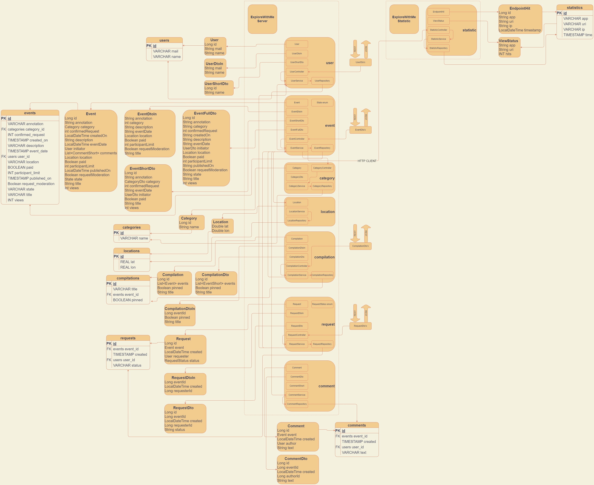

# Explore With Me Statistic

Сервис зависит от базы данных postgreSQL statistic:
* POSTGRES_USER = root
* POSTGRES_PASSWORD = root
* POSTGRES_DB = statistic
* server.port = 9090

###*__Используемые технологии__*
Java Coretto 11, Spring-Boot 2.7.2, postgresql 14.4.0, Driver PSQL 42.3.6, Lombok 1.18.24, Docker-compose 3.8, GSON 2.9.0, Http client 4.5.13, Jpa, JDBC 4.2, Hibernate 6.2.3

###*__Структура приложения__*

+ Сервис сбора статистики - [Swagger file](https://github.com/Nexler0/java-explore-with-me/blob/7d125350f7c8aced23df0387fdd9d91414ff8df4/ewm-stats-service-spec.json)

##*__Запуск__*

Для запуска необходимо запустить [Docker-Compose.yml](https://github.com/Nexler0/java-explore-with-me/blob/7d125350f7c8aced23df0387fdd9d91414ff8df4/docker-compose.yml)
Или из командной строки: _docker-compose -p ewm up_

Запуск на локальной машине:

1) Необходимо создать базу данных postgreSQL explorewithme:
    * POSTGRES_USER = root
    * POSTGRES_PASSWORD = root
    * POSTGRES_DB = explorewithme
2) Необходимо создать базу данных postgreSQL statistic:
    * POSTGRES_USER = root
    * POSTGRES_PASSWORD = root
    * POSTGRES_DB = statistic
3) Запустить сервис ExploreWithMeApp
    * server.port = 8080
4) Запустить сервис StatisticApp
    * server.port = 9090